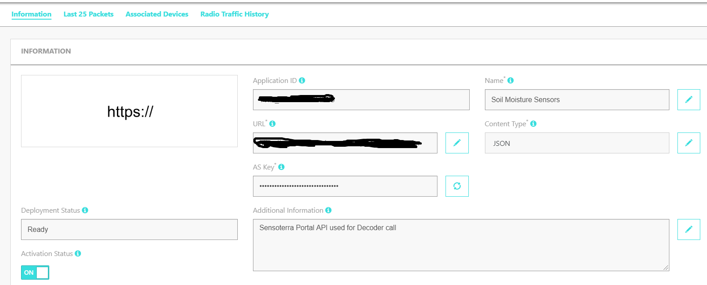
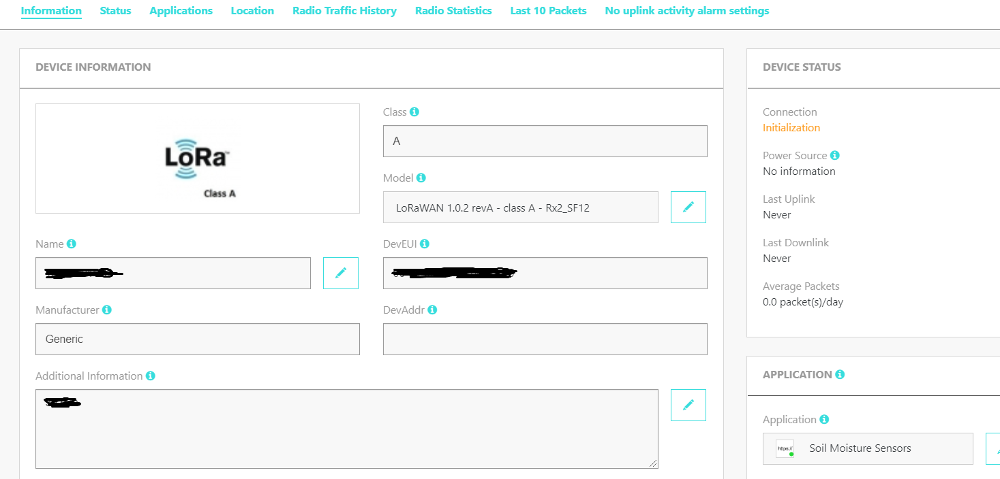
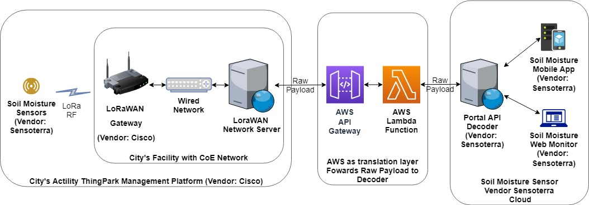

# moisture-sensor-integration

Integrating the LoRaWAN enabled Sensottera Moisture Sensor with Actility ThingPark Platform

* * *

**Integration Setup Guide:**

**A, Create AWS Lambda Function as Application**

1.  Go to [AWS Management Console](https://us-west-2.console.aws.amazon.com/console/home?region=us-west-2#) -> [Lambda](https://us-west-2.console.aws.amazon.com/lambda/home?region=us-west-2#/discover) -> Functions -> Create Function
    -   Choose Use a blueprint, search for and use blueprint named: microservice-http-endpoint-python
2.  Under Basic information:
    -   Function Name: e.g. sensoterra-decode-lambda-microservice
    -   Execution Role: Create a new role from AWS policy templates
    -   Role Name: e.g. sensoterra-decode-lambda-microservice-role
3.  Under API Gateway trigger
    -   API: Create a new API
    -   Security: Open
    -   Name: e.g. sensoterra-decode-lambda-microservice-API
4.  Click on Create Function
5.  In the Lambda Function Designer Panel, choose the API gateway on the left side, you will find the http API endpoint, this will be used later in Section B
6.  In the Lambda Function Designer Panel, choose the lambda function in the center, in the Function code panel below, copy the code in [this repo](https://github.com/CityofEdmonton/moisture-sensor-integration)'s src/lambda_function.py file to the opened lambda_function.py editor.
7.  Put in the credentials for the Sensoterra Portal API in the variable “client_id” and “client_secret”. These are used to call the Sensoterra Portal API. Obtain the credentials at <https://monitor.sensoterra.com/oauth>
8.  Ctrl+S to save the code, and click on the save on the top right corner.

**B, Create Generic Http Endpoint as application in Actility ThingPark**

Go to the Application TAB in ThingPark, choose add a generic http application, use the api endpoint obtained in Section A. Give this application a name, and in Section C, this single application will be shared by every sensor added as a device, by associating each sensor with the application just created.

**C, Create Sensoterra Moisture Sensor as device in Actility ThingPark**

Go to the Device TAB in ThingPark, and add as generic LoRa device, type in the DevEUI, AppEUI, App Key provided by vendor Sensoterra, choose class A device, and use the Serial number provided by Sensoterra as the device name. Associate each sensor with the Application created in Section B.

* * *

**How it works?**

Sensors -> Gateway -> Actility ThingPark -> AWS API Gateway http application -> AWS Lambda function -> Sensoterra Portal API -> Sensoterra Mobile and Web APP

**_Notes:_**

Sensor (Setup):

1.  Add the sensor to the Sensoterra Mobile App by scanning the QR code or enter the serial number.
2.  Reference the [Sensorterra Setup Guide](https://support.sensoterra.com/hc/en-us/articles/360021538471-Installation-Care-Guide-Single-depth-soil-moisture-sensor), wake the sensors up by holding them upright by the pins at the bottom, turning them upside down for 2 seconds and then turning them upright again, then push into the soil.
3.  The sensor will send uplink join request (OTAA) to the LoRaWAN network
4.  After receiving a join accept (OTAA) from the network, the sensor will start to send actual data

LoRaWAN Network:

1.  After the adding the Sensor as device in ThingPark, and receiving the join request (OTAA) from the Sensor, the Network Server will send a downlink join accept (OTAA).
2.  The network server will send the received actually data raw payload to the AWS API Gateway http endpoint (created in Setup Guide Section A5, used in Section B) using the HTTP POST method. In AWS, the Lambda function will be triggered by the POST request sent to the API Gateway http endpoint.
3.  The Lambda function reads the DevEUI and Payload, Fcnt, Fport from the POST request. Then it sends a POST request to the Sensoterra Portal API decoder method with the appropriate data format, using the provided credentials in Setup Guide Section A7.

Sensoterra Side:

1.  The Portal API, Sensoterra App, and Sensoterra Web Monitor (Customer Portal) are provided by Sensoterra.
2.  The Portal API receives the POST request sent by the Lambda Function, and decodes the raw payload into time and moisture level data. It then sends the data to the Sensoterra App, and Sensoterra Web Monitor.

* * *

**References:**

1.  Sensoterra Portal API documentation: <https://monitor.sensoterra.com/apiportal/v2/>
2.  Sensoterra Help Center: <https://support.sensoterra.com/hc/en-us>
3.  Sensoterra Web Monitor (Customer Portal): [https://monitor.sensoterra.com](https://monitor.sensoterra.com/)
4.  Sensoterra Credentials (For Portal API): <https://monitor.sensoterra.com/oauth>
5.  Sensorterra Setup Guide: <https://support.sensoterra.com/hc/en-us/articles/360021538471-Installation-Care-Guide-Single-depth-soil-moisture-sensor>
6.  Understanding And Using REST APIs: <https://www.smashingmagazine.com/2018/01/understanding-using-rest-api/>
7.  CityofEdmonton/moisture-sensor-integration Github Repo: <https://github.com/CityofEdmonton/moisture-sensor-integration>
